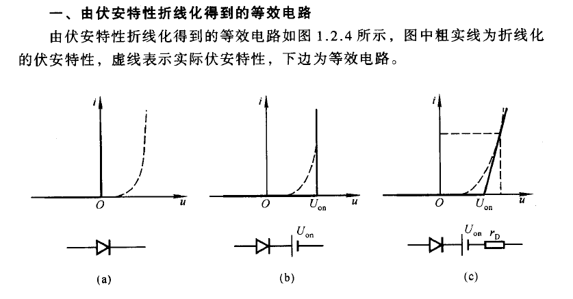
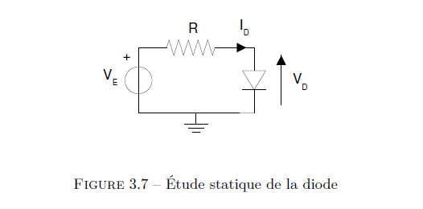
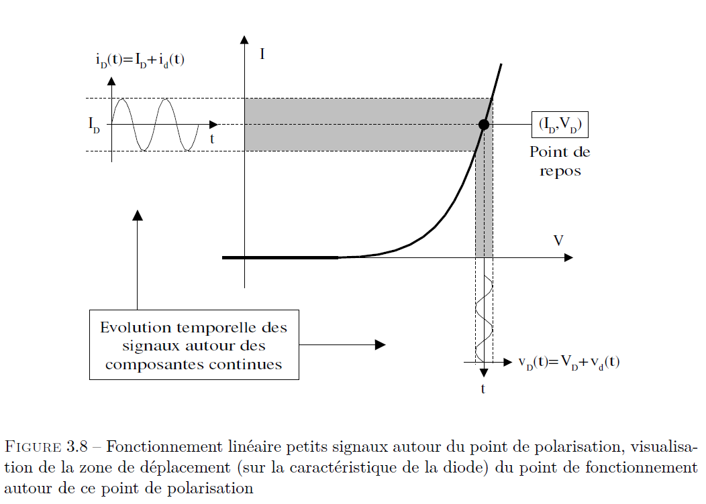

## 前言

略

# 3.1 半导体 描述

### 3.1.1（半导体）极化

请参照[《模拟电子技术基础 童施白等》](https://jalng-my.sharepoint.com/personal/wxu_a1p_b4_cm/Documents/For%20S5/%E5%85%B6%E4%BB%96%E5%8F%82%E8%80%83%E8%B5%84%E6%96%99/%E6%A8%A1%E6%8B%9F%E7%94%B5%E5%AD%90%E6%8A%80%E6%9C%AF%E5%9F%BA%E7%A1%80%20%E7%AC%AC%E5%9B%9B%E7%89%88%20by%20%E7%AB%A5%E8%AF%97%E7%99%BD%20%E5%8D%8E%E6%88%90%E8%8B%B1%20%E6%B8%85%E5%8D%8E%E5%A4%A7%E5%AD%A6%E7%94%B5%E5%AD%90%E5%AD%A6%E6%95%99%E7%A0%94%E7%BB%84%20(z-lib.org).pdf)中的第一章：常用半导体器件 部分。

由伏安特性折线化得到的等效电路：

图 (c) 所示的折线化伏安特性表明当二极管正向电压 $U$ 大于 $U_{\text {on }}$ 后其电流 $I$ 与 $U$ 成线性关系, 直线斜率为 $1 / r_{\mathrm{D}}$ 。二极管截止时反向电流为零。因此等效电路是理想二极管串联电压源 $U_{\mathrm{on}}$ 和电阻 $r_{\mathrm{D}}$, 且 $r_{\mathrm{D}}=\Delta U / \Delta I_{\circ}$

p.s.图 a 的数学描述：

$$
I_{d}=I_{s}\left[\exp \left(\frac{q V_{d}}{n k T}\right)-1\right]
$$

### 3.1.2 行为

对上一条公式中若干常数的解释：

* $I_S$，某个常数？，没搞懂
* $q$ 电子电荷数，1.6*10^-19 C
* k 波尔茨曼常数，1.38 * 10^-23
* T 开尔文温标
* $I_d, V_d$ 为二极管两段的电流和电压

### 3.1.4 二极管重要参数

– VF : tension de coude de la diode spécifiée à un courant direct donné.  
– IF : courant direct permanent admissible par la diode à la température maxi de fonctionnement.  
– IFSM : courant temporaire de surcharge (régime impulsionnel). En général, pour un courant  
de surcharge donné, le constructeur spécifie l’amplitude des impulsions, leur durée, le  
rapport cyclique, et dans certains cas, le nombre maxi d’impulsions qu’on peut appliquer.  
– VR : c’est la tension inverse maxi admissible par la diode (avant l’avalanche).  
– IR : c’est le courant inverse de la diode. Il est spécifié à une tension inverse donnée, et pour plusieurs températures (généralement 25°C et Tmax). Ce courant n’est pas seulement celui dû aux porteurs minoritaires. Il provient aussi des courants parasites à la surface de la puce (le silicium est passivé par oxydation, et il peut subsister des impuretés qui vont permettre le passage de faibles courants). Le boitier d’encapsulation de la puce (le silicium est passivé par oxydation, et il peut subsister des impuretés quivont permettre le passage de faibles courants). Le boitier d’encapsulation de la puce de silicium est aussi source de fuites.

* $V_F$ 正向拐点电压
* $I_F$ 最大整流电流：长期运行时允许通过的醉的正向平均电流
* $I_{FSM}$ 临时过载电流
* $V_R$ 最大反向电压
* $I_R$ 最大反向电流

### 3.1.5 二极管技术

普通二极管，快速整流二极管，稳压二极管，信号二极管，（可控）雪崩二极管， 发光二极管，

# 3.2 信号二极管的组成

### 3.2.1 静态研究（Etude statique)

以下图所示的电路为例，研究电流与电压的关系 $I_d = f(V_d)$。

两个工作区：

1. 当左端电压小于导通电压 $V_0$ 时，二极管处于近似断路状态，此时电阻两端电压约等于 0， $V_d \approx E< V_0$。(on vérifie ainsi que la diode est ==bloquée==)
2. E 大于二极管的导通电压时，可以用下列关系式：

    $$
    I_{d}=\frac{E-V_{d}}{R}
    $$

    就酱。此时二极管可以等效为一个施加相反方向电压的理想电池串联一个电阻。
3. 更精确的拟合函数为：

    $$
    I_{d}=I_{s}\left[\exp \left(\frac{q V_{d}}{n k T}\right)-1\right]
    $$

### 3.2.2 动态研究（etude dynamique) 二极管的微变等效电路

> 当二极管外加直流正向电压时，将有一直流电流，曲线上反应该电压和电流的点为 point de repos。在这个点附近外加微小的变化量，那么我们就可以用以该店为切点的直线来近似微笑变化时的曲线。
>

在研究时，不妨令此时的总电流为一直流电流加上一微小的交流电流，同样的，电压也可以这样表示。

这样分析的结果就是，在二极管的**工作点位**附近（point de polarisation, point de fonctionnement)施加扰动电压时（例如一个复读较小的正弦波？），我们可以在示波器上探测到同样的正弦波。

