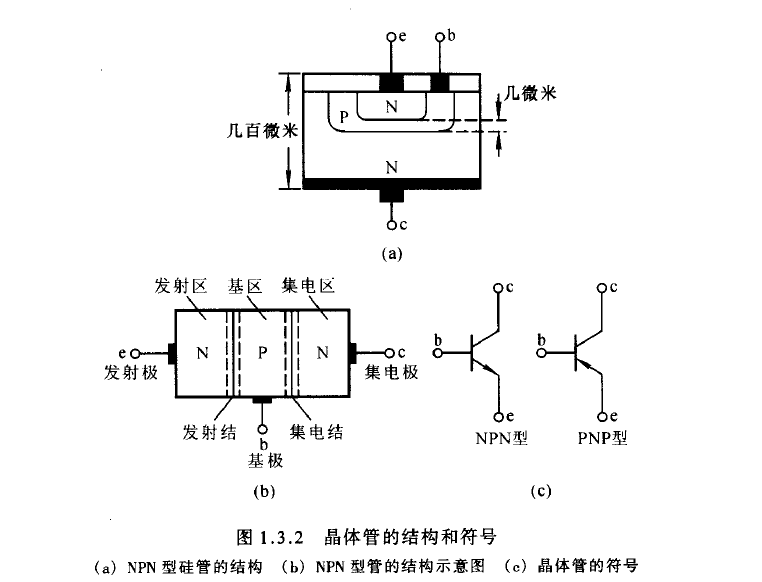
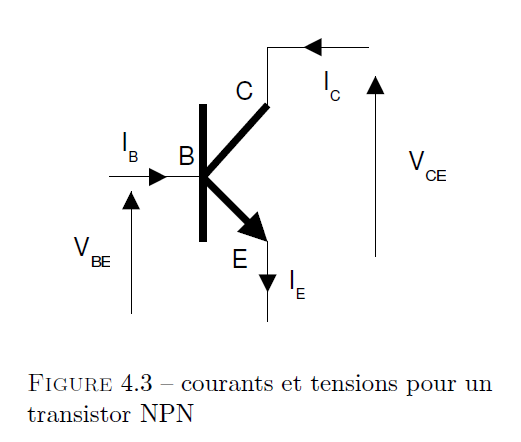
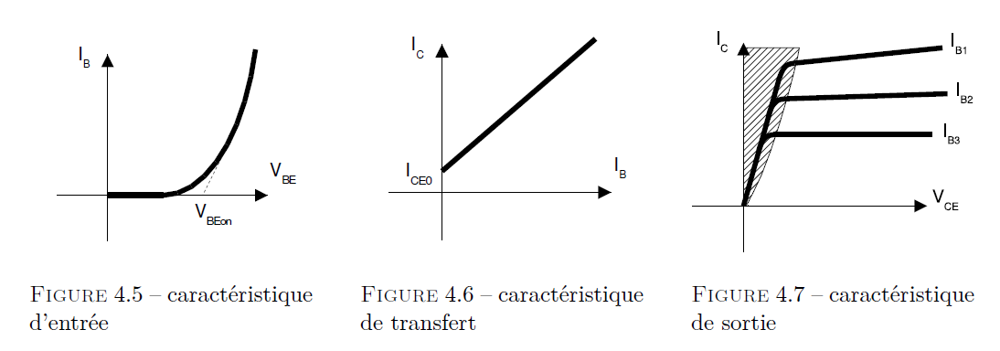
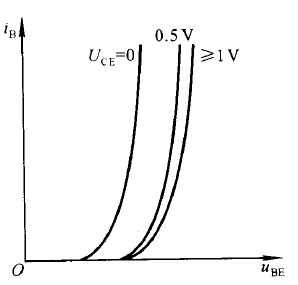
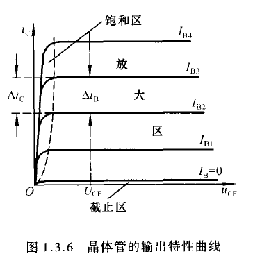
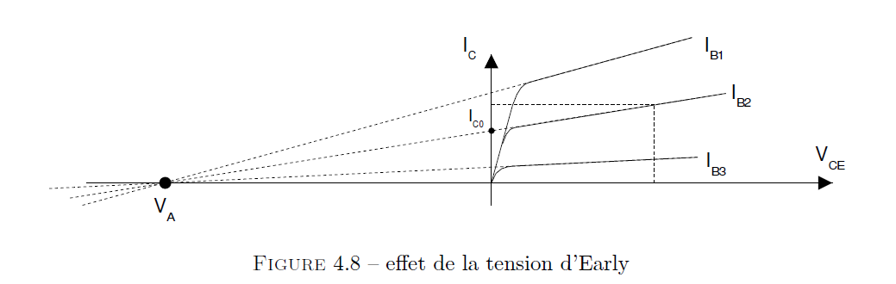

## 前言：

略

## 4.1 晶体管效应

### 4.1.1 介绍

### 4.1.2 晶体管效应原理（principe de l'effet transistor)

["晶体管的电流放大作用"](siyuan://blocks/20211116083335-2j1eerm)

#### 晶体管的共射电流放大系数

在上面这个电路中，若有输入电压 $\Delta u_1$ 作用，则晶体管的基极电流将在 $I_B$ 基础上叠加动态电流 $\Delta i_{B}$，当然集电极电流也将在 $I_C$ 基础上叠加动态电流 $\Delta i_C$，$\Delta i_C$ 与 $\Delta i_{B}$ 之比成为**共射交流电流放大系数**，记作 $\beta$，即：

$$
\beta=\frac{\Delta i_{\mathrm{C}}}{\Delta i_{\mathrm{B}}}
$$

如果我们另起一套表示逻辑且抛开晶体管内部的电流结构的研究的话，下面的表示更加方便：

以及上图若干电流之间的关系：

$$
\begin{aligned}
&I_{C}=\beta I_{B} \\
&I_{E}=(\beta+1) I_{B} \\
&I_{B}=I_{E}-I_{C}
\end{aligned}
$$

以及在["晶体管的电流放大作用"](siyuan://blocks/20211116083335-2j1eerm)中比较详细描述的 $I_{CB0}$，即*集电极*与*基极*之间的电流。在一般情况下，我们将其忽略。此时，式 1 可以写为：

$$
I_{C}=I_{C E 0}+\beta I_{B}
$$

### 4.1.3 晶体管类型

两种晶体管：NPN 与 PNP 晶体管

#### NPN 晶体管

没啥好说的

#### PNP 晶体管

也没啥好说的

### 4.1.4 晶体管性质（以 NPN 为例）

#### 输入特性曲线：（基极与发射极）Caractéristique d'entrée

$$
I_{B}=f\left(V_{B E}\right) @ V_{C E}=\text { cste }
$$

注：上式中 @ 后的内容意为：在 $V_{CE}$ 是常数的情况下。

$$
i_{\mathrm{B}}=\left.f\left(u_{\mathrm{BE}}\right)\right|_{U_{\mathrm{CE}}=\text { 常数 }}
$$

> 当 $V_{CE}$ 为 0 时，相当于集电极与发射极短路，即发射结与集电结并联。因此，输入特性与 PN 结的伏安特性曲线相似，呈指数关系。
>
> 当 $V_{CE}$ 增大时，曲线将右移。（见下图）
>
> 
>
> 当 $U_{\mathrm{CE}}$ 增大时, 曲线将右移, 见上图中标注 $0.5 \mathrm{~V}$ 和 $\geqslant 1 \mathrm{~V}$ 的曲线。这是因为, 由 发射区注入基区的非平衡少子有一部分越过基 区和集电结形成集电极电流 $i_{\mathrm{C}}$, 使得在基区参 与复合运动的非平衡少子随 $U_{\mathrm{CE}}$ 的增大 (即集电结反向电压的增大) 而减小; 因此, 要获得同样的 $i_{\mathrm{B}}$, 就必须加大 $u_{\mathrm{BE}}$, 使发射区向基区注入更多的电子。
>
> 实际上, 对于确定的 $U_{\mathrm{BE}}$, 当 $U_{\mathrm{CE}}$ 增大到一定值以后, 集电结的电场已足够强, 可以将发射区注入基区的绝大部分非平衡少子都收集到集电区, 因而再 增大 $U_{\mathrm{CE}}, i_{\mathrm{C}}$ 也不可能明显增大了, 也就是说, $i_{\mathrm{B}}$ 已基本不变。因此, $U_{\mathrm{CE}}$ 超 过一定数值后, 曲线不再明显右移而基本重合。对于小功率管, 可以用 $U_{\mathrm{CE}}$ 大 于 $1 \mathrm{~V}$ 的任何一条曲线来近似 $U_{\mathrm{CE}}$ 大于 $1 \mathrm{~V}$ 的所有曲线。 
>

As

对此，我们常用的数学关系式为：

$$
I_{E}=I_{e s}\left[\exp \left(\frac{V_{B E}}{V_{T}}\right)-1\right]
$$

avec $V_{T}=\frac{k T}{q} \approx 26 m V, I_{e s}$, courant inverse de saturation de la diode base-émetteur.

#### 传递特性曲线：（接收端与发射端）Caractéristique de transfert

$$
I_{C}=f\left(I_{B}\right) @ V_{C E}=\text { cste }
$$

亦即：

$$
i_{\mathrm{C}}=\left.f\left(u_{\mathrm{CE}}\right)\right|_{I_{\mathrm{B}}=\text { 常数 }}
$$

在理论上，发射极电流与基极电流成正比（见[上图](siyuan://blocks/20211116221644-ag54c3t)中的 FIGURE 4.6)，因此其传递特性是一条直线。考虑漏电流 $I_{CB0}$ 时，该直线不经过原点，即 $I_{C}=I_{C E 0} \text { for } I_{B}=0$。

对于晶体管至关重要的放大系数 $\beta$ 与晶体管的类型有关。通常，大功率晶体管的 $\beta$ 为 5-10，中等功率的为 30-80，信号晶体管的传递系数为 100-500.

#### 输出特性曲线 Caractéristique de sortie

$$
I_{C}=f\left(V_{C E}\right) \text { @ } I_{B}=\text { cste }
$$

即：

$$
i_{\mathrm{C}}=\left.f\left(u_{\mathrm{CE}}\right)\right|_{I_{\mathrm{B}}=\text { 常数 }}
$$

基极电流 $I_{B}$ 为一常量时，集电极（输入级）电流 $i_{C}$ 与管压降 $V_{CE}$（$V_{CC}$)之间的函数关系。

对于每一个确定的 $I_{B}$，都有一条曲线，所以输出特性曲线是一族曲线。如下面两张图所示。

> 对于每一个确定的 $I_{\mathrm{B}}$, 都有一条曲线，所以输出特性是一族曲线, 如图 $1.3 .6$ 所示。
>
> 对于某一条曲线，当 $u_{\mathrm{CE}}$ 从零逐渐增大时，集电结电场随之增强，收集基区非平衡少子的能力逐渐增强，因而 $i_{\mathrm{C}}$ 也就逐渐增大。而当 $u_{\mathrm{CE}}$ 增大到一定数值时，集电结电场足以将基区非平衡少子的绝大部分收集到集电区来，$u_{\mathrm{CE}}$ 再增大，收集能力已不能明显提高，表现为曲线几乎平行于横轴，即 $i_C$ 几乎仅仅决定于 $I_{B}$。
>
> 我们据此定义晶体管的三个区域：
>
> 1. 截止区：(zone de blocage)
>
>     发射结电压小于开启电压且集电结反向偏置。对于共射电路, $\boldsymbol{u}_{\mathrm{BE}} \leqslant \boldsymbol{U}_{\mathrm{On}}$ 且 $\boldsymbol{u}_{\mathrm{CE}}>\boldsymbol{u}_{\mathrm{BE}}$。 此时 $I_{\mathrm{B}}=0$, 而 $i_{\mathrm{C}} \leqslant I_{\mathrm{CE} 0}$ 。  
>     小功率硅管的 $I_{\mathrm{CE0}}$ 在 $1 \mu \mathrm{A}$ 以下, 锗管的 $I_{\mathrm{CE0}}$ 小于几十微安。因此在近似分析中可以认为==晶体管截止时的 $i_{\mathrm{C}} \approx 0$ ==。
>
> 2. 放大区：(zone de fonctionnement lineaire)
>
>     其特征是发射结正向偏置 $\left(u_{\mathrm{BE}}\right.$ 大于发射结开启电压 $U_{\mathrm{on}}$ ) 且集电结反向偏置。  
>     对于共射电路, $\boldsymbol{u}_{\mathrm{BE}}>\boldsymbol{U}_{\mathrm{on}}$ 且 $\boldsymbol{u}_{\mathrm{CE}} \geqslant \boldsymbol{u}_{\mathrm{BE}}$。 此时, $i_{\mathrm{C}}$ 几乎仅 仅决定于 $i_{\mathrm{B}}$, 而与 $u_{\mathrm{CE}}$ 无关, ==表现出 $i_{\mathrm{B}}$ 对 $i_{\mathrm{C}}$ 的控制作用,== $I_{\mathrm{C}}=\bar{\beta} I_{\mathrm{B}}, \Delta i_{\mathrm{C}}=$ $\beta \Delta i_{\mathrm{B}}$ 。在理想情况下, 当 $I_{\mathrm{B}}$ 按等差变化时, 输出特性是一族横轴的等距离 平行线。
> 3. 饱和区：(zone de saturation)
>
>     其特征是发射结与集电结均处于正向偏量，对于共射电路，$\boldsymbol{u}_{\mathrm{BE}}>\boldsymbol{U}_{\mathrm{on}}$ 且 $\boldsymbol{u}_{\mathrm{CE}}<\boldsymbol{u}_{\mathrm{BE}}$。此时 $i_{\mathrm{C}}$ 不仅与 $i_{\mathrm{B}}$ 有关，而且明显随 $u_{\mathrm{CE}}$ 增大而增大，$i_{\mathrm{C}}$ 小于 $\bar{\beta} I_{\mathrm{B}}$ 。  
>     在实际电路中，若晶体管的 $u_{\mathrm{BE}}$ 增大时，$i_{\mathrm{B}}$ 随之增大，但 $i_{\mathrm{C}}$ 增大不多或基本不变，则说明晶体管进入饱和区。对于小功率管，可以认为当 $u_{\mathrm{CE}}$ $=u_{\mathrm{BE}}$，即 $u_{\mathrm{CB}}=0 \mathrm{~V}$ 时，晶体管处于临界状态，即临界饱和或临界放大状态。
>

一般我们保证晶体管处于放大状态。

在["放大区"](siyuan://blocks/20211116225832-dyraw9c)中时，一个更精确的数学模型如[上文](siyuan://blocks/20211116224913-9bft78v)所示，用等式来描述为：

$$
I_{C}=I_{C 0}+g_{0} V_{C E}
$$

with:

$$
g_{0}=\frac{\Delta I_{C}}{\Delta V_{C E}}=\frac{I_{C}}{V_{C E}-V_{A}} \approx \frac{I_{C}}{\left|V_{A}\right|}
$$

($g_0$ 即为图 4.8 任意线在放大区的斜率）

and:

$$
I_{C 0} \approx I_{e s} \exp \frac{V_{B E}}{V_{T}}
$$

当 $\left|V_{A}\right| \gg V_{C E}$ 时，我们就可以有：

$$
I_{C}=I_{C 0} (1+\frac{V_{C E}}{\left|V_{A}\right|})
$$

一个总结：

* 截止区：两结均截止，$I_{C} \approx I_{C E 0}$

* 饱和区：$V_{CE}$ 极微小（小于 100mV 且 $V_{BE}$ 远大于 $V_{CE}$ )，

* 放大区：该区间被上述两个区间所限制。对晶体管的最大功率亦有限制。

#### 使用限制：

暂时略。

#### 晶体管基本参数：（关于使用限制区间）

暂时略

### 4.1.5 （使用软件）对晶体管性质的仿真研究 Caractérisation d’un transistor bipolaire par la simulation

### 4.1.7 截止条件（Conditions de blocage)（晶体管位于截止区内的条件）

当我们需要晶体管位于其截止区时，我们需要保证其 PN 结不被穿透。即 $V_{BE}$ 始终小于 PN 结的开启电压（tension de coude)$V_{BEon}$。另一端也是如此。

$$
\mathrm{NPN}\left\{\begin{array} { l } 
{ V _ { B E } < V _ { B E o n } } \\
{ V _ { B C } < V _ { B E o n } }
\end{array} \quad \mathrm { PNP } \quad \left\{\begin{array}{l}
V_{B E}>V_{B E o n} \\
V_{B C}>V_{B E o n}
\end{array}\right.\right.
$$

### 4.1.8 饱和条件（Condition de saturation)（晶体管位于饱和区内的条件）

$$
\mathrm{NPN}\left\{\begin{array} { l } 
{ V _ { B E } > V _ { B E o n } } \\
{ V _ { B C } > V _ { B E o n } } \\
{ \beta I _ { B } > I _ { C } }
\end{array} \quad \text { PNP } \quad \left\{\begin{array}{l}
V_{B E}<V_{B E o n} \\
V_{B C}<V_{B E o n} \\
\beta I_{B}>I_{C}
\end{array}\right.\right.
$$

## 4.2 若干晶体管极化（计算）的例子（Examples de polarisation d'un transistor)

具体见手写笔记。（说实话中文笔记读起来还是比法语要好上不少的）

## 4.3 两个（最基本的）镜像电流源

具体见手写笔记

## 4.4 三极管的等效电路
