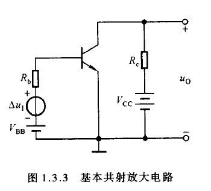
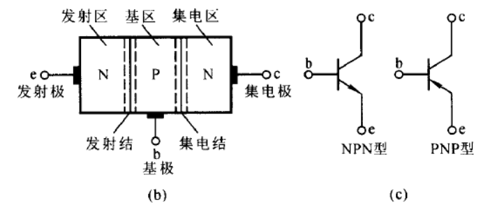
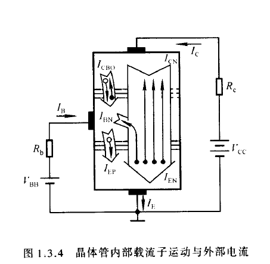

### 基本构成

晶体管是放大电路的核心原件，将输入的任何微小变化不失真地放大输出。

三个参数：

1. $\Delta u_1$：输入电压信号。
2. $V_{BB}$
3. $V_{CC}$

上图这个电路被称为**共射放大电路**。

晶体管在放大状态工作的外部条件是**发射结正向偏置且集电结反向偏置**。换言之，输入回路和输出回路中需要分别加载**基极电源 $V_{BB}$，和集电极电源 $V_{CC}$。**

二者的极性（正负极）如图所示。

### 电流（微观结构）

参数：（令人头秃且牙疼）

1. $I_B, I_C, I_E$
2. $I_{BN}, I_{CN}, I_{EN}$
3. $I_{CB0}, I_{EP}$

1. 发射结加正向电压，扩散运动形成发射极电流 $I_E$
2. 扩散到基区的自由电子与空穴的复合运动形成基极电流 $I_B$
3. 集电结加反向电压，飘逸运动形成集电极电流 $I_C$

设由发射区向基区扩散所形成的电子电流为 $I_{EN}$，基区向发射区扩散所形成的空穴电流为 $I_{EP}$ ，基区内复合运动所形成的电流为 $I_{BN}$ ，基区内非平衡少子（即发射区扩散到基区但未被复合的自由电子）漂移至集电区所形成的电流为 $I_{CN}$，平衡少子在集电区与基区之间的漂移运动所形成的电流为 $I_{CB0}$。

$$
\begin{aligned}
&I_{\mathrm{E}}=I_{\mathrm{EN}}+I_{\mathrm{EP}}=I_{\mathrm{CN}}+I_{\mathrm{BN}}+I_{\mathrm{EP}} \\
&I_{\mathrm{C}}=I_{\mathrm{CN}}+I_{\mathrm{CB0}} \\
&I_{\mathrm{B}}=I_{\mathrm{BN}}+I_{\mathrm{EP}}-I_{\mathrm{CB0}}=I_{\mathrm{B}}^{\prime}-I_{\mathrm{CB0}}
\end{aligned}
$$

外部：

$$
I_{\mathrm{E}}=I_{C}+I_{\mathrm{B}}
$$

### 电流：放大系数（前半部分）

电流 $I_{CN}$ 与 $I_B'$ 之比称为共射直流电流放大系数 $\bar{\beta}$，根据式 2 和 3 可得：

$$
\bar{\beta}=\frac{I_{\mathrm{CN}}}{I_{\mathrm{B}}^{\prime}}=\frac{I_{\mathrm{C}}-I_{\mathrm{CB0}}}{I_{\mathrm{B}}+I_{\mathrm{CB0}}}
$$

整理可得：

$$
I_{\mathrm{C}}=\bar{\beta} I_{\mathrm{B}}+(1+\bar{\beta}) I_{\mathrm{CB0}}=\bar{\beta} I_{\mathrm{B}}+I_{\mathrm{CE0}}
$$

一般情况下, $I_{\mathrm{B}} \gg I_{\mathrm{CBO}}, \bar{\beta} \gg 1$, 所以：

$$
\begin{aligned}
&I_{\mathrm{C}} \approx \bar{\beta} I_{\mathrm{B}} \\
&I_{\mathrm{E}} \approx(1+\bar{\beta}) I_{\mathrm{B}}
\end{aligned}
$$

一般情况下：

$$
\beta \approx \bar{\beta}
$$
