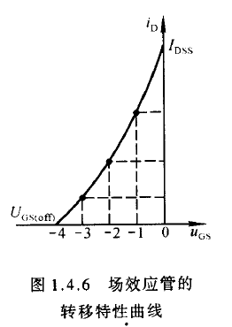

场效应管（FET），*利用输入回路*的电场效应来控制输出回路电流。它仅靠半导体中的多数载流子导电，因此又称**单极型晶体管**。

场效应管分为*结型*和*绝缘栅型*两种不同类型。

# 1. 结型场效应管（FET 管）

## 1. 结型场效应管基础构造

*N 沟道*和 *P 沟道*两种类型。

以 N 沟道==结型==的场效应管为例，其最直接的，最主观的工作原理为：**通过控制 g 端的电压来控制 d-s 两级间通过的电流**。

即用电场来控制电流。因此该元器件被叫做场效应管。

具体内容见["场效应管基础概念"](siyuan://blocks/20211207233657-sxnuq94)，这里直接给分析结果：

给出一个局限性很强的等效模型，或者说某些情况下的思维模型：==$V_G$, $V_D$, $V_S$ 依次为由高到低的三个电位，$U_{GS(off)}$ 是一段等长线段。==

我们主要考虑以下三种情况：

1. 在 $u_{\mathrm{GD}}=u_{\mathrm{GS}}-u_{\mathrm{DS}}>U_{\mathrm{GS}(\mathrm{off})}$ 的情况下, 即当 $u_{\mathrm{DS}}<u_{\mathrm{GS}}-U_{\mathrm{CS}(\mathrm{off})}$ (即 $\mathrm{g}-$ $\mathrm{d}$ 间末出现夹断)时, 对应于不同的 $u_{\mathrm{GS}}, \mathrm{d}-\mathrm{s}$ 间等效成不同阻值的电阻。  
    （==“四”字型耗尽层-沟道模型==）
2. 当 $u_{\mathrm{DS}}$ 使 $u_{\mathrm{GD}}=U_{\mathrm{GS}(\text { off })}$ 时, $\mathrm{d}-\mathrm{s}$ 之间==预夹断==。

3. 当 $u_{\mathrm{DS}}$ 使 $u_{\mathrm{GD}}<U_{\mathrm{GS}(\mathrm{off})}$ 时, $i_{\mathrm{D}}$ 几乎仅仅决定于 $u_{\mathrm{GS}}$, 而与 $u_{\mathrm{DS}}$ 无关。此时可以把 $i_{\mathrm{D}}$ 近似看成 $u_{\mathrm{GS}}$ 控制的电流源。  
    （==漏极-源极间电压太大，基本完全夹断，$u_{GS}$ 变成了止水夹==）

## 2. 结型场效应管的特性曲线

### 1. 输出特性曲线

场效应管有三个工作区域:

1. **可变电阻区(也称非饱和区)**: 图中的虚线为预夹断轨迹，它是各条曲线上使 $u_{\mathrm{DS}}=u_{\mathrm{GS}}-U_{\mathrm{CS}(\mathrm{Off})}\left[\right.$ 即 $\left.u_{\mathrm{CD}}=U_{\mathrm{GS}(\text { off })}\right]$ 的点连接而成的。 $u_{\mathrm{CS}}$ 愈大，预夹断时的 $u_{\mathrm{DS}}$ 值也愈大。预夹断轨道的左边区域称为可变电阻区，该区域中曲线近似为不同斜率的直线。当 $u_{\mathrm{GS}}$ 确定时，直线的斜率也唯一地被确定，直线斜率的倒数为 $\mathrm{d}-\mathrm{s}$ 间等效电阻。因而在此区域中，可以通过改变 $u_{\mathrm{GS}}$ 的大小 (即压控的方式) 来改变漏 - 源等效电阻的阻值，故称之为可变电阻区。  
    （情况 1， “四”字型沟道，["基础"](siyuan://blocks/20211207233657-sxnuq94)中非空载的 a 情形）
2. **恒流区(也称饱和区)**：图中==预夹断==轨迹的右边区域为恒流区。当 $u_{\mathrm{DS}}>$ $u_{\mathrm{GS}}-U_{\mathrm{CS}(\text { off })}$ （即 $u_{\mathrm{CD}}<U_{\mathrm{CS}(\text { off })}$）时, 各曲线近似为一族横轴的平行线。当 $u_{\mathrm{DS}}$ 增大时，$i_{\mathrm{D}}$ 仅略有增大。因而可将 $i_{\mathrm{D}}$ 近似为电压 $u_{\mathrm{GS}}$ 控制的电流源，故称该区域为恒流区。利用场效应管作放大管时，<u>应使其工作在该区域</u>。  
    （情形 2，预夹断区域，主要工作区域，["基础"](siyuan://blocks/20211207233657-sxnuq94)中非空载 b 情形）
3. **夹断区**：当 $u_{\mathrm{GS}}<U_{\mathrm{CS}(\mathrm{of})}$ 时，导电沟道被夹断，$i_{\mathrm{D}} \approx 0$，即图中靠近横轴的部分。称为夹断区。一般将使 $i_{\mathrm{D}}$ 等于某一个很小电流 (如 $5 \mu \mathrm{A}$ ) 时的 $u_{\mathrm{CS}}$ 定义为夹断电压 $U_{\mathrm{GS}(\text { off })}$ 。  
    （情形 3，完全夹断区域，止水夹模式，c 情形）

### 2. 转移特性

当漏-源电压 $U_{DS}$ 为常量时，漏极电流 $i_D$ 与栅-源电压 $u_{GS}$ 之间的关系。即：

$$
i_{\mathrm{D}}=\left.f\left(u_{\mathrm{GS}}\right)\right|_{U_{\mathrm{DS}}=\text { 常数 }}
$$

当场效应管工作在恒流区时，由于输出特性曲线可近似为横轴的一组平行线，所以可以用一条转移特性曲线代替恒流区的所有曲线。在输出特性曲线的恒流区中做横轴的垂线，读出垂线与各曲线交点的坐标值，建立 $u_{\mathrm{Gs}} 、 i_{\mathrm{D}}$ 坐标系，连接各点所得曲线就是转移特性曲线，见下图所示。可见转移特性曲线与输出特性曲线有严格的对应关系。

上图的近似数学表达式可以用半导体物理中对场效应管内部载流子的分析得到：

$$
i_{\mathrm{D}}=I_{\mathrm{DSS}}\left(1-\frac{u_{\mathrm{GS}}}{\left.U_{\mathrm{GS}(\text { off }}\right)}\right)^{2} \quad\left(U_{\mathrm{GS}(\text { off })}<u_{\mathrm{GS}}<0\right)
$$

# 2. 绝缘栅型场效应管（MOS 管）

## 1.绝缘栅型场效应管构造

这里讲的是栅极源极漏极之间的化学组成与制造工艺，故略。有空当小说看看就行。

同样由 N 沟道与 P 沟道两类。但每一种又分为*增强型*和*耗尽型*两种。排列组合后共有四种类型。

### 1. N 沟道与 P 沟道增强型 MOS 管

他们的具体标志如下：

#### 1. N 沟道的增强型 MOS 管

["N 型 MOS 管基本原理"](siyuan://blocks/20211208202114-kyo7329)

值得庆幸（？）的是，在 FET 管中出现的预夹断等概念在 MOS 管中仍然存在。下面我们研究他的特性曲线与电流方程。

MOS 管也有三个工作区域： 可变电阻区、恒流区以及夹断区（如上图所示）。

相似的，$i_D$ 与 $u_{GS}$ 的近似关系为：

$$
i_{\mathrm{D}}=I_{\mathrm{D} 0}\left(\frac{u_{\mathrm{CS}}}{U_{\mathrm{GS}(\mathrm{th})}}-1\right)^{2}
$$

式中 $I_{\mathrm{D} 0}$ 是 $u_{\mathrm{CS}}=2 U_{\mathrm{GS}(\mathrm{h})}$ 时的 $i_{\mathrm{D}}$ 。

#### 2. N 沟道的耗尽型 MOS 管

这里仅给出其图示，具体内容请参照["N 型 MOS 管基本原理"](siyuan://blocks/20211208202114-kyo7329)

#### 3.P 沟道 MOS 管

与 N 沟道 MOS 管相，P 沟道增强型 MOS 管的开启电压 $U_{G S(t h)}<0$，当 $u_{C S}<U_{C S(H)}$ 时管子才导通，漏 - 源之间应加负电源电压；P 沟道耗尽型 MOS 管的夹断电压 $U_{\mathrm{GS}(\mathrm{off})}>0，u_{\mathrm{GS}}$ 可在正负值的一定范围内实现对 $i_{\mathrm{D}}$ 的控制，漏－源之间也应加负电压。

#### 4. VMOS 管

略，课程大纲不要求。

# 3. 场效应管主要参数

## 1. 直流参数

1. 开启电压
2. 夹断电压
3. 饱和漏极电流
4. 直流输入电阻

## 2. 交流参数

1. 低频跨导
2. 极间电容

## 3. 极限参数

1. 最大漏极电压
2. 击穿电压
3. 最大耗散功率
