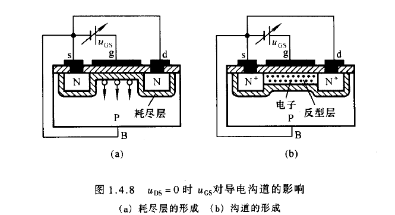

# 增强型 MOS 管

需要注意的是，MOS 管与结型场效应管导电机理与电流控制原理*均不相同*。[撇嘴]

1. 当==栅-源（g-s）之间没有电压时==，漏-源（d-s）之间是两只背向的 PN 结，==不存在导电沟道==。因此，即使我们在他们上面施加电压，也==不会有漏极电流==。
2. 当 $u_{\mathrm{DS}}=0$ 且 $u_{\mathrm{GS}}>0$ 时，由于 $\mathrm{SiO}_{2}$ 的存在，栅极电流为零。但是栅极金属层将聚集正电荷，它们排斥 P 型衬底靠近 $\mathrm{SiO}_{2}$ 一侧的空穴，使之剩下不能移动的负离子区，形成耗尽层，如下图所示。当 $u_{\mathrm{GS}}$ 增大时,一方面耗尽层增宽，另一方面将衬底的自由电子吸引到耗尽层与绝缘层之间，形成一个 $N$ 型薄层，称为反型层。如图 (b) 所示。这个反型层就构成了漏-源之间的导电沟道。使沟道刚刚形成的栅 - 源电压称为开启电压 $U_{\mathrm{GS}(\mathrm{th})}$ 。$u_{GS}$ 愈大，反型层愈厚，导电沟道电阻愈小。

当 $u_{\mathrm{CS}}$ 是大于 $U_{\mathrm{CS}(\mathrm{th})}$ 的一个确定值时，若在 d-s 之间加正向电压，则将产生一定的漏极电流。此时，$u_{\mathrm{DS}}$ 的变化对导电沟道的影响==与结型场效应管相似==。 即当 $u_{\mathrm{DS}}$ 较小时，$u_{\mathrm{DS}}$ 的增大使 $i_{\mathrm{D}}$ 线性增大，沟道沿源 - 漏方向逐渐变窄，如下图（a）所示。一旦 $u_{\mathrm{DS}}$ 增大到使 $u_{\mathrm{GD}}=U_{\mathrm{CS}(\mathrm{th})}\left(\right.$ 即 $\left.u_{\mathrm{DS}}=u_{\mathrm{GS}}-U_{\mathrm{CS}(\mathrm{th})}\right)$ 时, 沟道在漏极一侧出现夹断点，称为==预夹断==，如下图（b）所示。如果 $u_{\mathrm{DS}}$ 继续增大，夹断区随之延长，如下图 (c) 所示。而且 $u_{\mathrm{DS}}$ 的增大部分几乎全部用于克服夹断区对漏极电流的阻力。从外部看，$i_{\mathrm{D}}$ 几乎不因 $u_{\mathrm{DS}}$ 的增大而变化，管子进人==恒流区==，$i_{\mathrm{D}}$ 几乎仅决定于 $u_{\mathrm{GS}}$ 。

在 $u_{\mathrm{DS}}>u_{\mathrm{CS}}-U_{\mathrm{GS}(\mathrm{th})}$ 时，对应于每一个 $u_{\mathrm{GS}}$ 就有一个确定的 $i_{\mathrm{D} 。}$ 此时，可将 $i_{\mathrm{D}}$ 视为==电压 $u_{\mathrm{CS}}$ 控制的电流源==。  
（真·令人头秃）

# 耗尽型 MOS 管

如果在制造 MOS 管时，在 $\mathrm{SiO}_{2}$ 绝缘层中掺人大量正离子，那么即使 $u_{\mathrm{CS}}=$ 0 ，在正离子作用下 P 型祇底表层也存在反型层，即漏 - 源之间存在导电沟道。 只要在漏 - 源间加正向电压，就会产生漏极电流，如下图 (a) 所示。并且，$u_{\mathrm{GS}}$ 为正时，反型层变宽，沟道电阻变小，$i_{\mathrm{D}}$ 增大；反之，$u_{\mathrm{GS}}$ 为负时，反型层变窄，沟道电阻变大，$i_{\mathrm{D}}$ 减小。而当 $u_{\mathrm{GS}}$ 从零减小到一定值时，反型层消失，漏 - 源之间导电沟道消失，$i_{\mathrm{D}}=0$ 。此时的 $u_{\mathrm{GS}}$ 称为==夹断电压== $U_{\mathrm{GS}(\mathrm{off})}$ 。 与 $\mathrm{N}$ 沟道结型场效应管相同，N 沟道耗尽型 MOS 管的夹断电压也为负值。但是，<u>前者只能在 $u_{\mathrm{GS}}<0$ 的情况下工作，而后者的 $u_{\mathrm{GS}}$ 可以在正、负值的一定范 围内对 $i_{\mathrm{D}}$ 的控制, 且仍保持栅 - 源间有非常大的绝缘电阻。</u>  
（主要区别）  

耗尽型 MOS 管的符号见下图所示。

