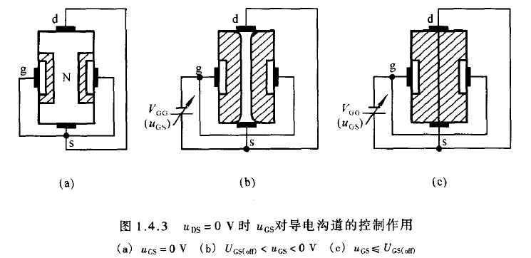
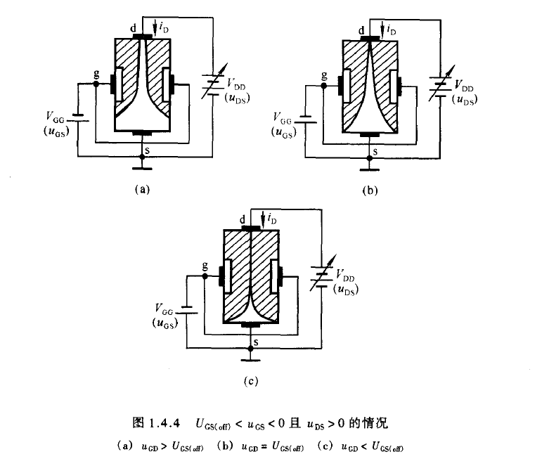

# 空载（d-s 电压为 0）情况

1. 当 g 端电压为 0，d-s 电压为 0 时，如图 a 中所示，==耗尽层==很窄，导电==沟道==很宽。也就是说，电流可以很自由地流过。
2. $U_{\mathrm{GS}(\text { off })}<u_{\mathrm{GS}}<0 \mathrm{~V}$，即控制端-源端电压增大时，==耗尽层==增大，==沟道==变窄，电阻增大。
3. $\left|u_{\mathrm{GS}}\right|$ 增大到一定数值时，==耗尽层==闭合，==沟道== 消失。我们可以认为此时电阻趋于**无穷大。**
4. 当 $\left|u_{\mathrm{GS}}\right|$ 处于 0 至 $U_{GS(off)}$ （上述三幅图均*没有表示* ）时，需要考虑 $u_{DS}$ 对漏极电流 $i_D$ 的影响。  
    若 $u_{DS}>0$，那么就有电流从漏极（d）流向源极（s）。此时，沟道中各点与栅极（g）之间的电压不再相等。但是，==只要不出现夹断区域==，漏极电流 $i_D$ 仍将基本上==取决于栅-源电压 $u_{GS}$  
    ==。 

    此时，电流 $i_D$ 将会随 $u_{DS}$ 的增大而线性增大，源极与漏极之间呈现**电阻特性**。然而，一旦 $u_{DS}$ 增大使得 $u_{GD} = U_{GD(off)}$ ，那么漏极一边的耗尽层就会出现==夹断区==（如下图的 b 中的情况）。这种情形被称为==预夹断==。

    若 $u_{DS}$ 继续增大，那么夹断区就会继续延长，或者说耗尽层闭合部分继续沿着沟道延伸（如图 c 中的情况）。

    * 断区加长, 见图 (c)所示。这时，一方面自由电子从漏极向源极定向移动所受阻力加大 (只能从夹断区的窄缝以较高速度通过), 从而导致 $i_{D}$ 减小;
    * 另一方 面, 随着 $u_{\mathrm{DS}}$ 的增大, 使 $\mathrm{d}-\mathrm{s}$ 间的纵向电场增强, 也必然导致 $i_{\mathrm{D}}$ 增大。

# 非空载（d-s 电压不为 0）情况

实际上，上述 $i_{\mathrm{D}}$ 的两种变化趋势相抵消，$u_{\mathrm{DS}}$ 的增大几乎全部降落在夹断区，用于克服夹断区对 $i_{\mathrm{D}}$ 形成的阻力。因此，==从外部看，在 $u_{\mathrm{CD}}<U_{\mathrm{GS}(\mathrm{off})}$ 的情况下，当 $u_{\mathrm{DS}}$ 增大时 $i_{\mathrm{D}}$ 几乎不变，即 $i_{\mathrm{D}}$ 几乎仅仅决定于 $u_{\mathrm{GS}}$, 表现出 $i_{\mathrm{D}}$ 的恒流特性。==  
当 $u_{\mathrm{GD}}<u_{\mathrm{GS}(\mathrm{off})}$ 时, $u_{\mathrm{GS}}$ 对 $i_{\mathrm{D}}$ 的控制作用  
在 $u_{\mathrm{CD}}=u_{\mathrm{CS}}-u_{\mathrm{DS}}<U_{\mathrm{CS}(\mathrm{off})}$, 即 $u_{\mathrm{DS}}>u_{\mathrm{CS}}-U_{\mathrm{GS}(\mathrm{off})}$ 的情况下, 当 $u_{\mathrm{DS}}$ 为一 常量时, 对应于确定的 $u_{\mathrm{CS}}$, 就有确定的 $i_{\mathrm{D}}$ 。此时, 可以通过改变 $u_{\mathrm{GS}}$ 来控制 $i_{\mathrm{D}}$ 的大小。由于漏极电流受栅 - 源电压的控制, 故称场效应管为电压控制元 件。与晶体管用 $\beta\left(=\Delta i_{\mathrm{C}} / \Delta i_{\mathrm{B}}\right)$ 来描述动态情况下基极电流对集电极电流的控 制作用相类似, 场效应管用 $g_{\mathrm{m}}$ 来描述动态的栅 - 源电压对漏极电流的控制作 用, $g_{\mathrm{m}}$ 称为低频跨导：

$$
g_{\mathrm{m}}=\frac{\Delta i_{\mathrm{D}}}{\Delta u_{\mathrm{GS}}}
$$
